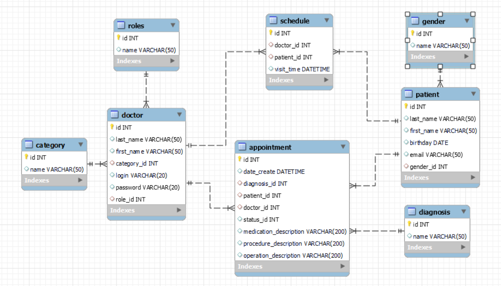

###### **HOSPITAL SERVICE**

## Overview

The **Hospital Service** system is designed to assist administrators in managing doctors and patients efficiently. The system provides functionalities such as sorting patients and doctors, assigning doctors to patients, recording diagnoses and treatments, and managing hospital discharge reports.

### Features
- **Sorting options:**
  - Patients:
    - Alphabetically
    - By date of birth
  - Doctors:
    - Alphabetically
    - By category
    - By number of patients
- **Patient and doctor management:**
  - The administrator registers patients and doctors.
  - The administrator assigns doctors to patients.
- **Medical records:**
  - Doctors determine diagnoses and prescribe treatments (procedures, medications, surgeries).
  - Nurses can administer prescribed procedures and medications.
  - All treatments are recorded in the **Hospital Card**.
- **Patient discharge:**
  - The system allows discharging patients with a final recorded diagnosis.
  - (Optional) Export discharge details as a document.

## Prerequisites
To run this project, you need:
- **Java 17**
- **Gradle** (for building and running the project)
- **Postgres** (relational database used by the system)

## Running the Project

1. **Ensure Java 17 is installed**
   ```sh
   java -version
   ```
   If Java is not installed, download it from [Oracle](https://www.oracle.com/java/technologies/javase/jdk17-archive-downloads.html) or install via your package manager.

2. **Build the service using Gradle**
   ```sh
   ./gradlew clean build
   ```
   **Build the service using Maven**
   ```sh
   mvn clean package
   ```
3. **Run the service**

   After building the WAR file, you need to deploy it to your Tomcat server.

   - Copy the generated WAR file from the target/ (Maven) or build/libs/ (Gradle) directory.

   - Place the WAR file into the webapps/ directory of your Tomcat installation.

   - Start or restart your Tomcat server.


## Database Configuration

The project uses a **Postgres** database.
- **Database connection:**
  - The connection string is retrieved from the `app.properties` file.

- **Database initialization:**
  - The SQL script to create the database is located in the `resources/sql` directory.
  - File: `db-create.sql`



---

### Additional Information
For further details on installation, configuration, or contributing to this project, please refer to the project documentation or contact the development team.
